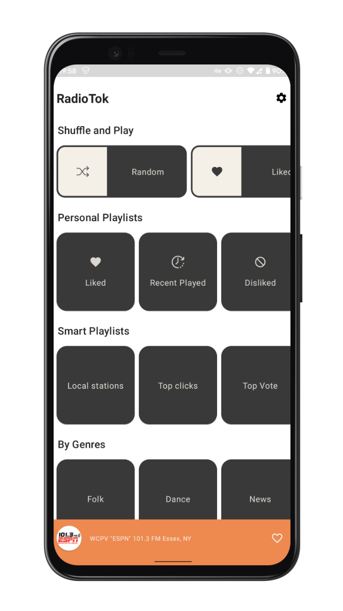
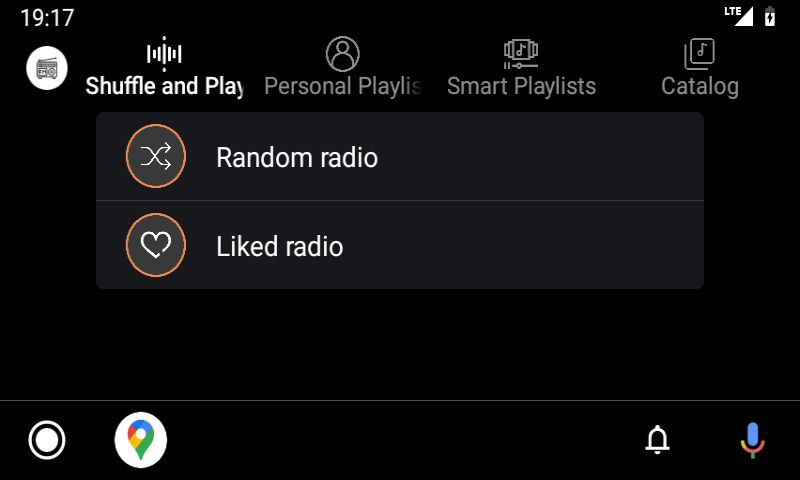
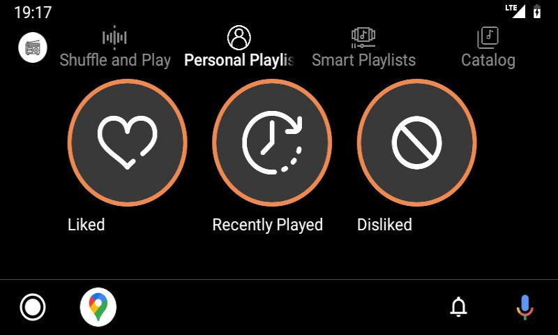

<h2 align="center">
    RadioTok - listen to the radio from over the world
</h2>

## Under active development ✏️

### - Android phone UI

### - Android Auto UI
 

## Key features: 
- Simple approach for listening radio
- Full support Android Auto, able to like/dislike radio stations, playlists and etc
- Build with Jetpack Compose
- Custom MediaItem DSL library

## Roadmap

https://github.com/egorikftp/RadioTok/issues/7
